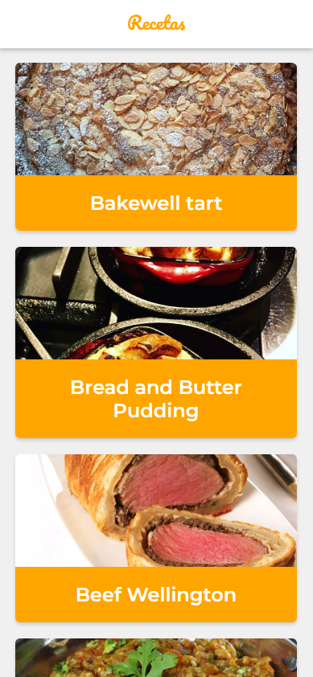

# Curso de PWA con React en Platzi

App a modo de ejemplo para ver recetas de cocina.

## Scripts

* `npm install` para instalar las dependencias
* `npm run dev` para entorno de desarrollo
* `npm run build && npm start` para producción

## Licencia 

MIT